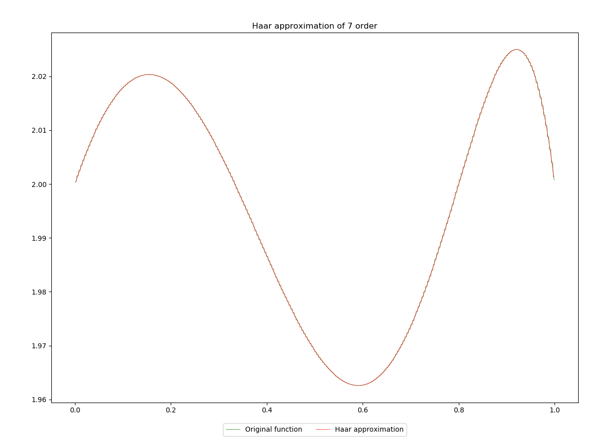
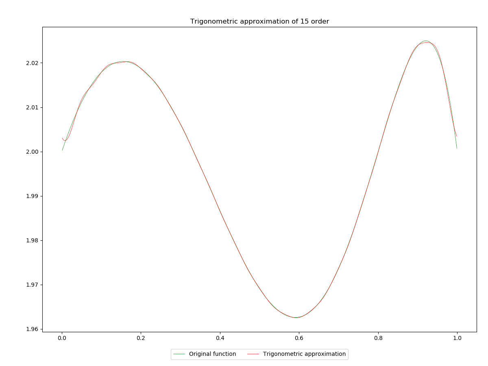

# Classic approximations [](https://github.com/morfinPL/classicApproximations/actions/workflows/CI.yml) [](https://github.com/morfinPL/classicApproximations/actions/workflows/pages.yml) [](https://github.com/morfinPL/classicApproximations/actions/workflows/pages/pages-build-deployment) [](https://opensource.org/licenses/MIT)

## [Documentation](https://morfinpl.github.io/classicApproximations)

## Implemented methods:
1. Fourier coefficients and ortonormal system based methods:
    - Haar approximation,
    - Legendre approximation,
    - Trigonometric approximation.
2. Other methods
    - Chebyshev approximation.

## Run
To run our script you must have python3 and install requirements from requirements.txt file. Then you can simply run

```python run.py -h```

for any other details.

## Examples
1. Examples of Haar approximation
    - 3 order
        
    - 5 order
        
    - 7 order
        
2. Examples of Legendre approximation
    - 3 order
        
    - 5 order
        
    - 7 order
        
3. Examples of Trigonometric approximation
    - 3 order
        
    - 7 order
        
    - 15 order
        
4. Examples of Chebyshev approximation
    - 5 order
        
    - 6 order
        
    - 7 order
        


[LICENSE](LICENSE).